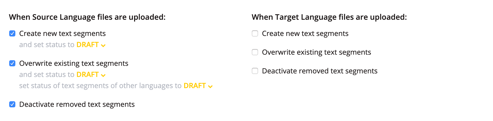
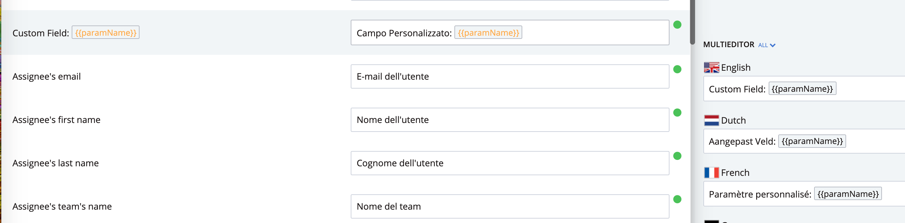
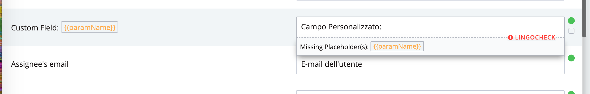
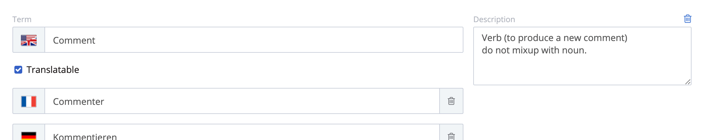
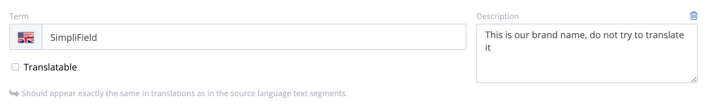
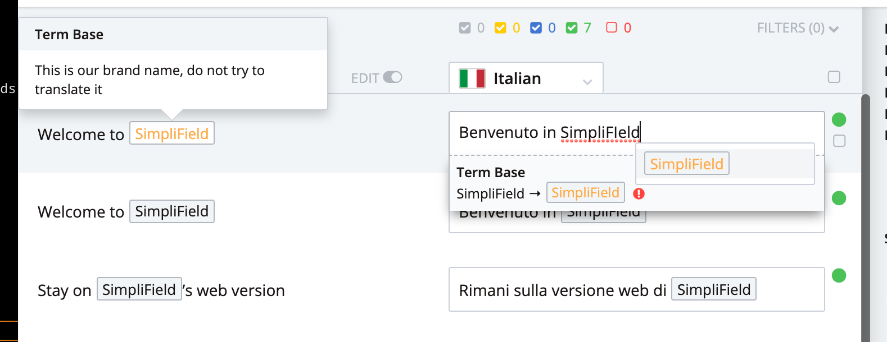

# i18n @ SimpliField

:gb::fr::de::ru::flag-nl::it::es::jp::flag-pt::flag-pl:

---

## Tools

- `.json` files
- [Lingohub](https://translate.lingohub.com/simplifield/dashboard)
- Slack : #product-trad

---

## People

| language               | speakers              |
| ---------------------- | --------------------- |
| :gb::fr:               | Always more people!   |
| :de:                   | Theodor               |
| :ru:                   | Kate, ukrainian teams |
| :it:                   | Liliana               |
| :es:                   | Liliana, Arthur       |
| :flag-pt:              | Liliana, Johanna?     |
| :jp::flag-nl::flag-pl: | ∅                     |

---

## JSON files

- Beware to formatting (`cmd`+`shift`+`P` format document)
  - **NO** trailing comma in arrays / objects
  - Quotes must be double `"` for keys an values

```
{
  "KEY": "Value with \"escaped\" quotes"
}
```

- Nesting can be used for namespacing (hierarchy)

---

## Lingohub

- _English is the SSOT_
- if you changes something in your json files in your code
  - If key is unknown by LH
    - your key and values in every languages will be added to LH
    - every translation for that key will be marked as draft
  - If key is known by LH
    - your change will be reflected only in english
    - every other translations will be marked as draft

---

### Lingohub settings



---

## Lingohub tips & tricks


---

## Placeholders

- use this syntax:

```
{
  "KEY": "Lorem {{someVar}} ipsum"
}
```

- valid for angular-translate files and i18next
  - some work need to done (pdf)
- Token will be locked for the translators! and lingocheck will fail if not provided

---



---



---

## Terms Base

> Enfore consistency with our own business words!

---



---



---



---


---

We have lot of business terms to enforce, product team I count on you !

> See you on Slack#product-trad

---

## Messageformat

- Translating is hard
- Pluralization is worse
- Not detected by Lingohub

---

### Rule of thumb

- Provide a singular form and a plural form.
  - MF will handle the grammar for you
- give the counter name a identifier that look identifier
  - `nb` is good, `count` bad, `commentCount` is worse
  - ideal would be something like `_mf_nb` (to discuss)

```
{
  "key": "There {nb, plural, one{is # item} other{are # items}}."
}
{
  "key": "Il y a {nb, plural, one{# chose} other{# choses}}."
}
```

---

[Tech WIKI !](https://github.com/SimpliField/sf-platform/wiki/i18n)

---

I'm available for all your questions! Ik ben beschikbaar voor al uw vragen! Sono disponibile per tutte le tue domande! Je suis disponible pour toutes vos questions! Ich stehe für alle Ihre Fragen zur Verfügung! 私はあなたのすべての質問に応えます！ Jestem dostępny na wszystkie twoje pytania! Я готов ответить на все ваши вопросы! Estoy disponible para todas sus preguntas!

---

Thanks!

---